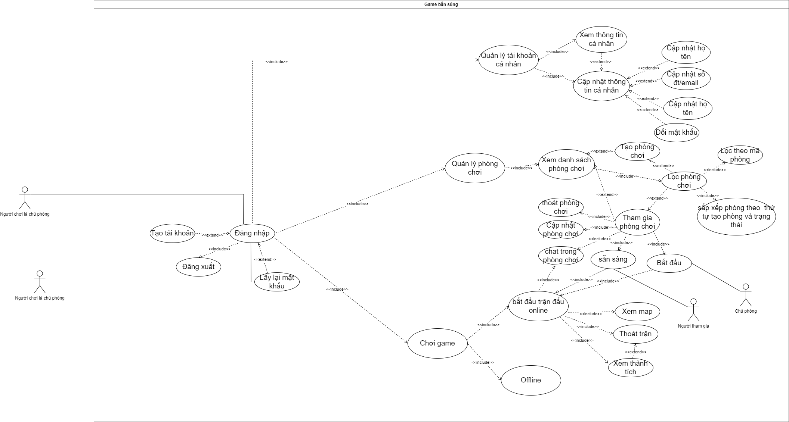
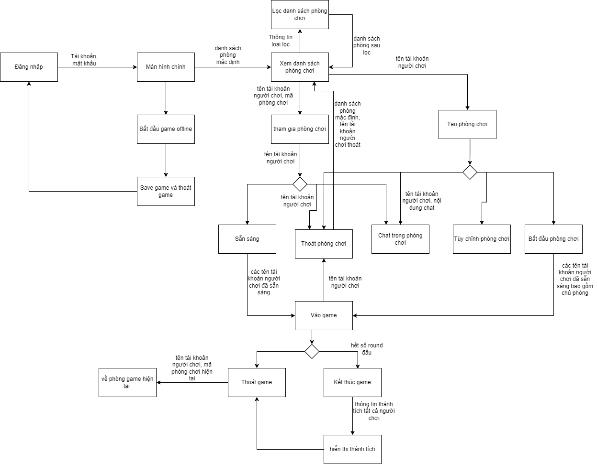
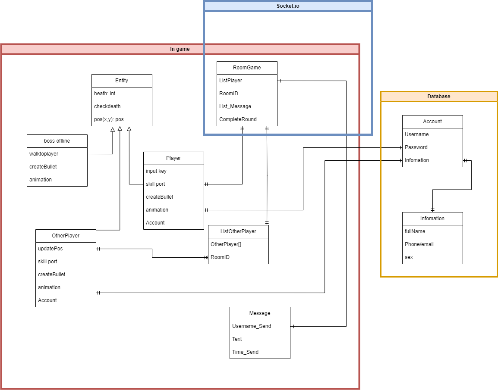

#### Dự án môn Phát Triển Phần Mềm Mã Nguồn Mở 
### Đề tài: Làm game bắn súng online trên cổng mạng hoặc dùng socket public 
### Đường dẫn trang giới thiệu game: https://mintie1808.github.io/introgame2d/

#### Hướng dẫn cài đặt:
### run command `git clone https://github.com/kidcher1412/PTPMMNM.git`
### run command `cd PTPMMNM`
### Config your ip in settings.py (if you want run Server socket game)
### run command `python3 sever_test.py`
### Join socket room or run game (online-offline)
### run command `python3 mainGUI.py`

# Thành viên thực hiện: 
|MTV  |MSSV        |Họ và tên           |
|:---:|:----------:|--------------------|
|1    |3120560093  |Hoàng Lê Anh Thông  |
|2    |3120410575  |Trần Trọng Trường   |
|3    |3120410360  |Phan Thành Nhân     |
|4    |3120410528  |Nguyễn Minh Tiến    |
## Giáo viên hướng dẫn: Từ Lãng Phiêu
# Luật làm việc: 
- Các công việc được giao mỗi thành viên phải commit đúng vào branch với tên ứng với <tên thành viên>-<mã thành viên> (VD: thong-1). Trừ các task test unit và test chức năng thì commit tại branch dev-test
- Các thành viên colab không được thực hiện thao tác merge code mà chưa thông qua trong cuộc họp
- Các trường hợp không thể commit dúng hạn theo dự tính phải báo trước nhóm về lý do và task out-time
- mọi font chữ trong game đều dùng font trong thư mục /p1_setup/font/myFont.ttf cho đồng bộ khi merge
# Chức năng yêu cầu:
- Chức năng đăng nhập (tạo-cập nhật-lấy lại mật khẩu-thay đôi thông tin tài khoản (có thể cập nhật trường mật khẩu, email/sdt))
- Chức năng tạo phòng/tham gia phòng: Khi tham gia phòng các người chơi có thể chat, sẵn sàng, chủ phòng bắt đầu trận đấu, thay đổi bản đồ đấu. Có chức năng tham gia phòng đấu bằng ID phòng
- Chức năng đấu online theo phòng đấu đã định: người chơi bắn súng với nhau: các chức năng xem bản đồ với vị trí hiện tại, đổi vũ khí, skill, thoát trận , chat trong trận
- Về chức năng cá nhân hóa (nêu kịp thực hiện): người chơi có thể chọn trang phục trong kho đồ, chức năng nạp tiền, mua skin, mở cổng thanh toán online, mua thẻ đổi tên nhân vật
# Giao diện
comming soon 
# Document about Project
- Usercase:
 
 - Data Workflow
 
 - Env deploy
 
# Cách kéo và chạy code:  
- Kéo code kham khảo ở main bằng lệnh pull:
### `git pull origin main`
- Chạy lệnh pip install tại đường dẫn vừa pull về:
### `pip install -r requirements.txt`
- chạy game bằng lệnh:
### `python main.py`

# công cụ phát triển:
- Tạo map: Tiled 
- Tạo model nhân vật: Aseprite

